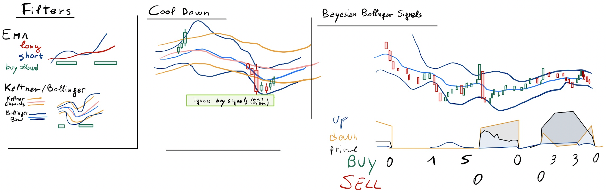

# Strategy

The Bayesian Bollinger is a strategy based on the price swinging betwwen the lower and upper
Bollinger bands (bbands).
It is based to the concept that the observation of how many candles hitting the bbands
inte past could predict the direction of the price in the future.

## Filtering and Cooldown 

The oscillator returns various signal types, but the signal are filtered using 2 ema
long/short, and a Keltner channel (kchannel) to account for favourable volatility and trend.

Once the price hits the upper bollinger and the upper bollinger exceed the upper Keltner
channel, the strategy assumes that a period of downtrend could follow, starting a cooldown
period until the price rech the lower bband/kchannel

The code is made to run in the Binance spot market, and auto-recharge BNB to pay for fees.
It is important not to manually cleanup dust positions created by stop loss or
take profits orders

# Author

[79bass#4342](https://github.com/ffavero)

## Tip Jar Wallet

    *BEP-20*: 0xEAC8a0d3AB6761860395b33f74dea88B4F16aBcA
    *ERC20*:  0xEAC8a0d3AB6761860395b33f74dea88B4F16aBcA

# License

MIT
Copyright 2021 79bass

Permission is hereby granted, free of charge, to any person obtaining a copy of this software 
and associated documentation files (the "Software"), to deal in the Software without restriction, 
including without limitation the rights to use, copy, modify, merge, publish, distribute, 
sublicense, and/or sell copies of the Software, and to permit persons to whom the Software 
is furnished to do so, subject to the following conditions:

The above copyright notice and this permission notice shall be included in all copies or 
substantial portions of the Software.

# Inspiration

Strarting from [Batista Harahap](https://bango29.com/bayesian-probability-as-an-oscillator/) blogpost.

# Backtest Data

Testing individual symbols 15-05-2021 until 25-08-2021, starting from 1000 USDT
and reusing all the amount of the portfolio at every trade.
_realized pnl_ is the amount in excess from the initial 1000 USDT after the testing period

    24.08.2021-22:00:00> MATICUSDT winning positions 61/96, realized pnl: 1563.925
    24.08.2021-22:00:00> VITEUSDT winning positions 71/109, realized pnl: -54.147
    24.08.2021-22:00:00> 1INCHUSDT winning positions 57/95, realized pnl: 647.681
    24.08.2021-22:00:00> NKNUSDT winning positions 66/109, realized pnl: 912.231
    24.08.2021-22:00:00> NEOUSDT winning positions 65/103, realized pnl: 724.964
    24.08.2021-22:00:00> NANOUSDT winning positions 50/96, realized pnl: -88.331
    24.08.2021-22:00:00> RUNEUSDT winning positions 56/93, realized pnl: 1971.343
    24.08.2021-22:00:00> ZILUSDT winning positions 68/112, realized pnl: 735.102
    24.08.2021-22:00:00> COCOSUSDT winning positions 53/88, realized pnl: 1211.550
    24.08.2021-22:00:00> LUNAUSDT winning positions 56/106, realized pnl: 522.449
    24.08.2021-22:00:00> IRISUSDT winning positions 66/106, realized pnl: 1001.146
    24.08.2021-22:00:00> GTOUSDT winning positions 70/101, realized pnl: 1285.166

Not included in the strategy:

    24.08.2021-22:00:00> REEFUSDT winning positions 64/109, realized pnl: 697.124
    24.08.2021-22:00:00> REPUSDT winning positions 71/109, realized pnl: 347.365
    24.08.2021-22:00:00> MIRUSDT winning positions 43/77, realized pnl: 729.934

# Disclaimer

THE SOFTWARE IS PROVIDED "AS IS", WITHOUT WARRANTY OF ANY KIND, EXPRESS OR IMPLIED, 
INCLUDING BUT NOT LIMITED TO THE WARRANTIES OF MERCHANTABILITY, FITNESS FOR A PARTICULAR 
PURPOSE AND NONINFRINGEMENT. IN NO EVENT SHALL THE AUTHORS OR COPYRIGHT HOLDERS BE LIABLE 
FOR ANY CLAIM, DAMAGES OR OTHER LIABILITY, WHETHER IN AN ACTION OF CONTRACT, TORT OR OTHERWISE, 
ARISING FROM, OUT OF OR IN CONNECTION WITH THE SOFTWARE OR THE USE OR OTHER DEALINGS IN THE SOFTWARE.
